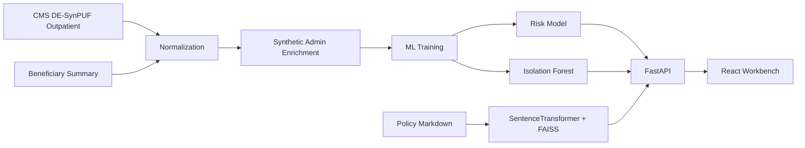

# HealthOps ClaimGuard AI

Explainable ML and unusual-claim detection for healthcare claims review prioritization.

## Portfolio Snapshot

HealthOps ClaimGuard AI is an end-to-end claims operations workbench. It combines CMS DE-SynPUF outpatient claims, synthetic administrative workflow signals, supervised denial-risk scoring, unusual-claim detection, policy evidence retrieval, and deterministic analyst brief generation.

The project is designed as reviewer decision support. It does not process PHI, make medical recommendations, or autonomously approve or deny claims.

## What It Does

- Scores a hybrid CMS DE-SynPUF plus synthetic administrative dataset for denial-risk review prioritization.
- Assigns LOW, MEDIUM, or HIGH risk bands.
- Shows model drivers for claim-level explainability.
- Flags unusual claims with Isolation Forest.
- Retrieves policy evidence and preserves source IDs for citations.
- Generates a deterministic analyst brief with rationale, next actions, citations, limitations, and a decision-support disclaimer.
- Separates public claims-derived fields from synthetic operational enrichment.

## Demo Flow

1. Open the dashboard and review volume, high-risk claims, average risk, unusual claims, top drivers, and the risk matrix.
2. Open the claims queue, filter by risk/anomaly/network, and select a high-risk claim.
3. Review claim facts, denial probability, explanation factors, unusual-claim status, and policy evidence.
4. Generate the analyst brief and point out that it is cited, deterministic, and non-adjudicative.
5. Open model insights to show held-out test metrics, global drivers, and data provenance.

## Validation Snapshot

- Dataset rows: 49,199
- Primary model: XGBoost
- Held-out test ROC-AUC: 0.7250
- Held-out test PR-AUC: 0.5646
- Precision at top 10 percent of scored claims: 0.7093
- Selected threshold: 0.2729
- Backend tests: 12 passing
- Frontend tests: 5 passing
- Frontend production build: passing
- Docker Compose config validation: passing

## Architecture



## Data Setup

Download CMS DE-SynPUF Sample 1 outpatient claims and optional 2008 beneficiary summary into `data/raw/`.

CMS Sample 1 page:
https://www.cms.gov/data-research/statistics-trends-and-reports/medicare-claims-synthetic-public-use-files/cms-2008-2010-data-entrepreneurs-synthetic-public-use-file-de-synpuf/de10-sample-1

Expected local files:

```bash
data/raw/DE1_0_2008_to_2010_Outpatient_Claims_Sample_1.zip
data/raw/DE1_0_2008_Beneficiary_Summary_File_Sample_1.zip
```

## Train

```bash
python -m pip install -r ml/requirements.txt
python ml/generate_data.py --limit-rows 50000
python ml/train.py
```

Outputs are written under `ml/artifacts/`.

## Reports

- `ml/artifacts/data_diagnostics.json`
- `ml/artifacts/metrics.json`
- `ml/artifacts/explainability_samples.json`
- `ml/artifacts/leakage_audit.json`

## Backend

```bash
python -m pip install -r backend/requirements.txt
set PYTHONPATH=backend
uvicorn app.main:app --app-dir backend --reload
```

Backend docs: `http://localhost:8000/docs`

API endpoints:

- `GET /api/v1/health`
- `GET /api/v1/claims`
- `GET /api/v1/claims/{claim_id}`
- `GET /api/v1/claims/{claim_id}/evidence`
- `GET /api/v1/claims/{claim_id}/brief`
- `GET /api/v1/analytics/summary`
- `GET /api/v1/analytics/drivers`
- `GET /api/v1/model/metrics`

Run backend tests:

```bash
set PYTHONPATH=backend
pytest backend/tests -q
```

## Frontend

```bash
cd frontend
npm install
npm run dev -- --host 127.0.0.1
```

Frontend app: `http://localhost:5173`

Run frontend checks:

```bash
cd frontend
npm test
npm run build
```

## Docker Compose

Train the ML artifacts first so `ml/artifacts/classifier.joblib` and `ml/artifacts/anomaly_detector.joblib` exist locally, then run:

```bash
docker compose build
docker compose up
```

Compose exposes:

- Frontend: `http://localhost:5173`
- Backend: `http://localhost:8000`
- Health: `http://localhost:8000/api/v1/health`

The frontend container proxies `/api/*` to the backend container. Both services include health checks.

## Make Targets

```bash
make install-backend
make train
make test-backend
make install-frontend
make test-frontend
make build-frontend
make docker-build
make docker-up
```

## Project Structure

```text
backend/   FastAPI, SQLite repository layer, ML/anomaly services, FAISS retrieval
data/      Raw CMS files are local only; processed claims CSV is generated
docs/      Architecture, model, responsible AI, and data provenance notes
ml/        CMS ingestion, administrative enrichment, diagnostics, and training
```

## Responsible AI

This project uses CMS synthetic public claims plus synthetic administrative fields. It does not provide medical advice, diagnose conditions, or autonomously deny claims. Outputs are decision support and must be verified by a human reviewer.
