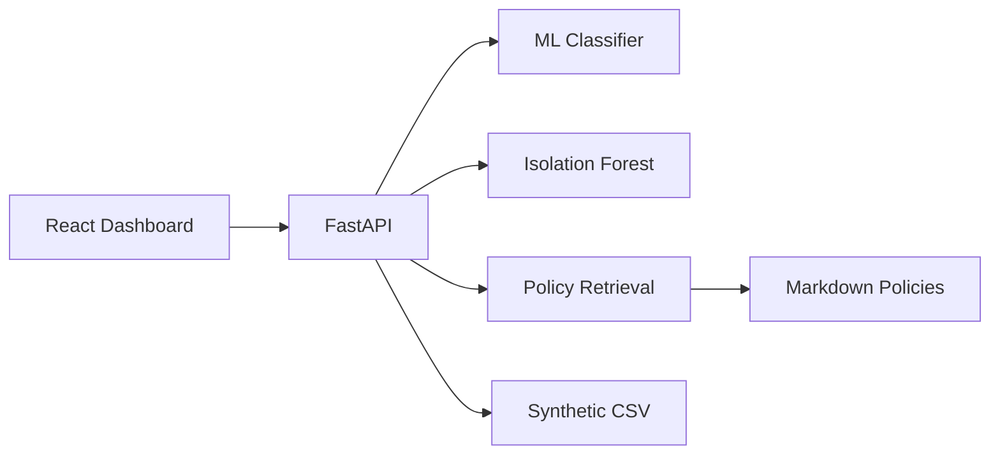

# HealthOps ClaimGuard AI

Explainable ML, unusual-claim detection, and evidence-grounded analyst briefs for healthcare claims operations.

## What It Does

- Scores synthetic healthcare claims for denial risk.
- Assigns LOW, MEDIUM, or HIGH risk bands.
- Shows model drivers for claim-level explainability.
- Flags unusual claims with Isolation Forest.
- Retrieves relevant policy snippets from a local knowledge base.
- Generates a grounded analyst brief with source IDs and a human-review disclaimer.

## Architecture



## Local Setup

```bash
python -m pip install -r backend/requirements.txt
python ml/generate_data.py
python ml/train.py
set PYTHONPATH=backend;.
uvicorn app.main:app --reload --app-dir backend
```

In another terminal:

```bash
cd frontend
npm install
npm run dev
```

Open `http://localhost:5173`.

## Docker

```bash
docker compose up --build
```

Frontend: `http://localhost:5173`  
Backend docs: `http://localhost:8000/docs`

## Tests

```bash
set PYTHONPATH=backend;.
pytest backend/tests -q
cd frontend
npm run build
```

## API

- `GET /api/v1/health`
- `GET /api/v1/claims`
- `GET /api/v1/claims/{claim_id}`
- `POST /api/v1/claims/upload`
- `GET /api/v1/analytics/summary`
- `GET /api/v1/analytics/drivers`
- `GET /api/v1/claims/{claim_id}/evidence`
- `POST /api/v1/claims/{claim_id}/brief`
- `GET /api/v1/model/metrics`

## Project Structure

```text
backend/   FastAPI application and tests
data/      Synthetic claims CSV and policy documents
docs/      Architecture, model, responsible AI, and demo notes
frontend/  React + Vite analyst UI
ml/        Synthetic data generation and model training
```

## Responsible AI

This project uses synthetic data only. It does not provide medical advice, diagnose conditions, or autonomously deny claims. Analyst briefs are decision support and must be verified by a human reviewer using source systems and payer policy.

