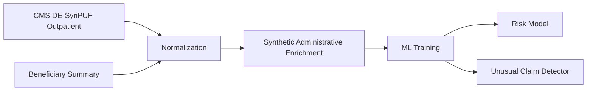

# HealthOps ClaimGuard AI

Explainable ML and unusual-claim detection for healthcare claims review prioritization.

## What It Does

- Scores a hybrid CMS DE-SynPUF plus synthetic administrative dataset for denial-risk review prioritization.
- Assigns LOW, MEDIUM, or HIGH risk bands.
- Shows model drivers for claim-level explainability.
- Flags unusual claims with Isolation Forest.
- Separates public claims-derived fields from synthetic operational enrichment.

## Architecture



## Data Setup

Download CMS DE-SynPUF Sample 1 outpatient claims and optional 2008 beneficiary summary into `data/raw/`.

CMS Sample 1 page:
https://www.cms.gov/data-research/statistics-trends-and-reports/medicare-claims-synthetic-public-use-files/cms-2008-2010-data-entrepreneurs-synthetic-public-use-file-de-synpuf/de10-sample-1

Expected local files:

```bash
data/raw/DE1_0_2008_to_2010_Outpatient_Claims_Sample_1.zip
data/raw/DE1_0_2008_Beneficiary_Summary_File_Sample_1.zip
```

## Train

```bash
python -m pip install -r ml/requirements.txt
python ml/generate_data.py --limit-rows 50000
python ml/train.py
```

Outputs are written under `ml/artifacts/`.

## Reports

- `ml/artifacts/data_diagnostics.json`
- `ml/artifacts/metrics.json`
- `ml/artifacts/explainability_samples.json`
- `ml/artifacts/leakage_audit.json`

## Backend

```bash
python -m pip install -r backend/requirements.txt
set PYTHONPATH=backend
uvicorn app.main:app --app-dir backend --reload
```

Backend docs: `http://localhost:8000/docs`

Stage 3 endpoints:

- `GET /api/v1/health`
- `GET /api/v1/claims`
- `GET /api/v1/claims/{claim_id}`
- `GET /api/v1/claims/{claim_id}/evidence`
- `GET /api/v1/claims/{claim_id}/brief`
- `GET /api/v1/analytics/summary`
- `GET /api/v1/analytics/drivers`
- `GET /api/v1/model/metrics`

Run backend tests:

```bash
set PYTHONPATH=backend
pytest backend/tests -q
```

## Project Structure

```text
backend/   FastAPI, SQLite repository layer, ML/anomaly services, FAISS retrieval
data/      Raw CMS files are local only; processed claims CSV is generated
docs/      Architecture, model, responsible AI, and data provenance notes
ml/        CMS ingestion, administrative enrichment, diagnostics, and training
```

## Responsible AI

This project uses CMS synthetic public claims plus synthetic administrative fields. It does not provide medical advice, diagnose conditions, or autonomously deny claims. Outputs are decision support and must be verified by a human reviewer.
