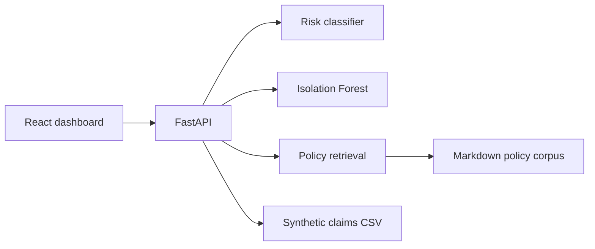

# Architecture

HealthOps ClaimGuard AI is a local demo system for claims operations triage. The React frontend calls a FastAPI backend under `/api/v1`. The backend scores synthetic claims with a trained scikit-learn classifier, flags unusual records with Isolation Forest, retrieves policy evidence with TF-IDF similarity, and returns a grounded analyst brief.

The implementation intentionally avoids PHI, autonomous claim decisions, and external LLM dependencies. The brief generator is deterministic and cites retrieved policy chunks.

