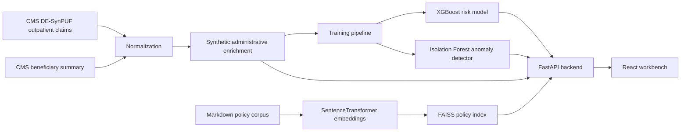

# Architecture

HealthOps ClaimGuard AI is a local demo system for claims operations triage. The React frontend calls a FastAPI backend under `/api/v1`. The backend scores synthetic claims with a trained supervised classifier, flags unusual records with Isolation Forest, retrieves policy evidence with SentenceTransformer embeddings plus FAISS, and returns a deterministic grounded analyst brief.

## Runtime Flow

1. The backend initializes SQLite from the processed sample claims CSV.
2. `MLService` loads the trained denial-risk model, preprocessing pipeline, threshold, and global feature importance.
3. `AnomalyService` loads the Isolation Forest artifact.
4. `RetrievalService` embeds synthetic policy chunks and builds a FAISS index.
5. The frontend uses API-backed dashboards, queues, and claim detail pages to support analyst review.
6. `BriefService` creates deterministic briefs grounded in claim facts, model explanations, anomaly status, and retrieved citations.

## Boundaries

The implementation intentionally avoids PHI, autonomous claim decisions, and external LLM dependencies. The brief generator is deterministic and cites retrieved policy chunks. Any real deployment would require governance review, real-world validation, access controls, monitoring, and human-in-the-loop operating procedures.
